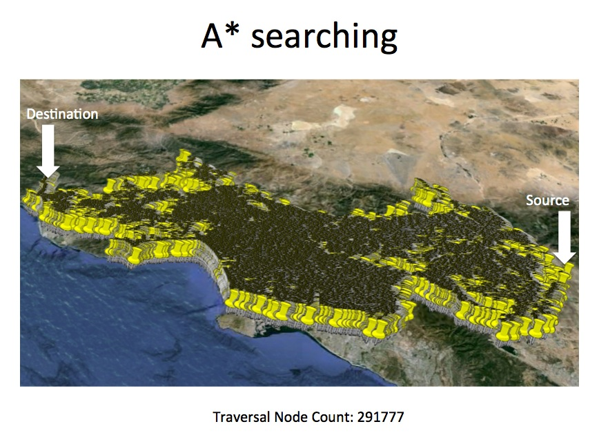
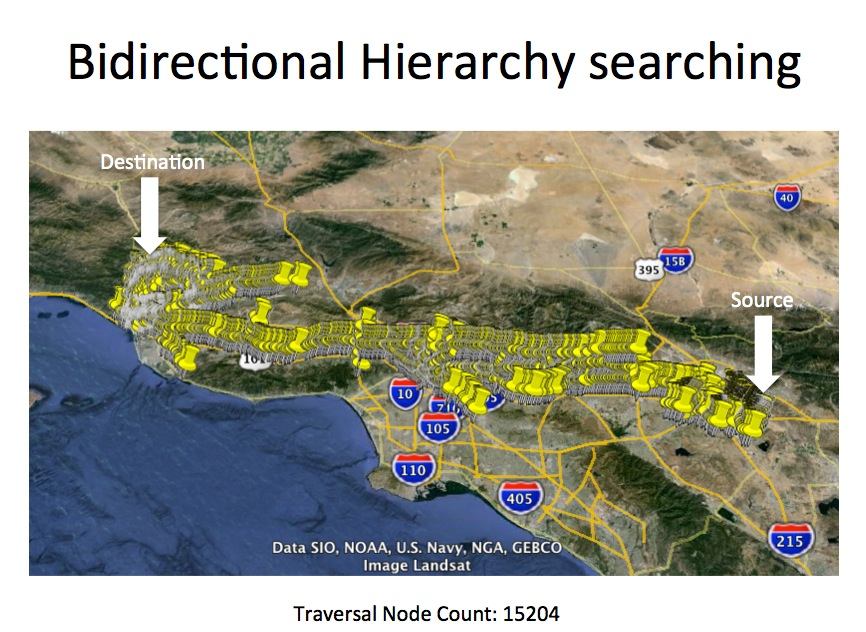
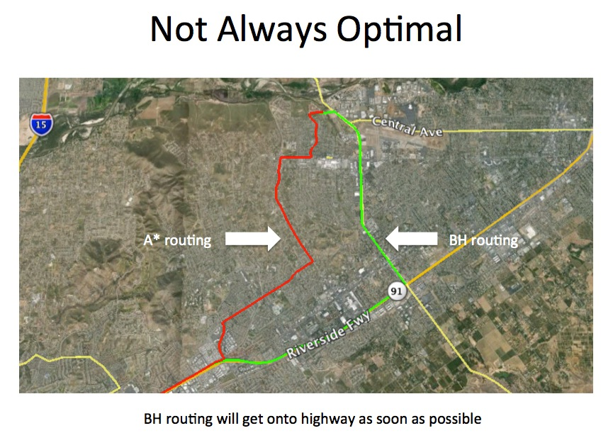

OpenStreetMap
=============

### GPS Project based on OpenStreetMap

### Demo

This is map near our campus I fetched from OSM Project and converted it to our project's format. 
And I cleaned all the shape, building, barrier,etc which cannot be used for routing.

### Bidirectional Hierarchy Searching
#### Introduction

1. From source and destination to perform forward searching and reverse searching simultaneously.
2. Forward searching is based on time dependent A* searching, but when it enter the highway, it will keep on highway.
3. Reverse searching is based on lower bound A* searching, it will also keep on highway when it hit the highway entrance.
4. When forward searching and reverse searching encounter on the highway, we will find a path.
5. The mechanism of hierarchy(keep on highway) will reduce the searching space and lead to less response time.
6. By the mechanism of bidirectional search, we do not worry about finding highway entrance and highway exit.

#### A* searching vs BH searching
Chose two long distance nodes in Los Angeles and perform A* routing, Bidirectional Hierarchy routing and compare.
<table>
    <tr>
        <td><b>Algorithm</b></td><td><b>Response Time</b></td><td>Search Space</td><td>Travel Cost</td>
    </tr>
    <tr>
        <td><b>A*</b></td><td><b>1485 ms</b></td><td>291777 nodes</td><td>150 min</td>
    </tr>
    <tr>
        <td><b>BH</b></td><td><b>225 ms</b></td><td>15204 nodes</td><td>150 min</td>
    </tr>
</table>

#### Reference
* [1] Sebastian Knopp, Peter Sanders, Dominik Schultes and Frank SchulzFast. Computation of Distance Tables using Highway Hierarchies, 2006.

### Manual

#### 1) put your "map.osm" in the "file" folder of the project

#### 2) osm2wkt/Osm2wkt
this step will get rid of the none-routable path, and please press "N" when it asked for fixCompleteness.
* read the data from OSM file
* get rid of unroutable data
* generate xxx.wkts file

#### 3) controller/OSMInputFileGeneration
* read the data from OSM file
* generate xxx_node.csv and xxx_way.csv from data

#### 4) controller/OSMOutputFileGeneration
* read the data from xxx_node.csv and xxx_way.csv
* according xxx.wkts, overwrite xxx_node.csv and xxx_way.csv

#### 5) controller/OSMDivideWayToEdge
* divide the long way to seperate edges based on intersect

#### 6) controller/OSMGenerateKML(Optional)
* generate edge kml
* generate node kml

#### 7) controller/OSMGenerateAdjList
* generate xxx_adjlist.csv file

All the preprocessing steps (1~7) can be done in the controller/OSMGenerateAll.
   
#### 8) controller/OSMRouting
* using A* algorithm for path routing
* using A* algorithm with fibonacci heap for path routing
* using bidirectional hierarchy routing algorithm for path routing
* show turn by turn information
   
#### 9) test/CompareTdspTdspHTimeCost
* compare the response time and cost time between A* algorithm and hierarchy routing algorithm

#### 10) test/AnalyzeTravelTimeMatrix
* calculate the travel time based on matrix data
